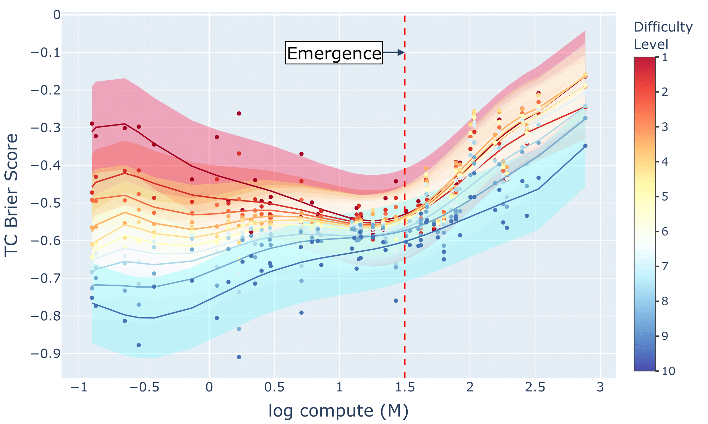
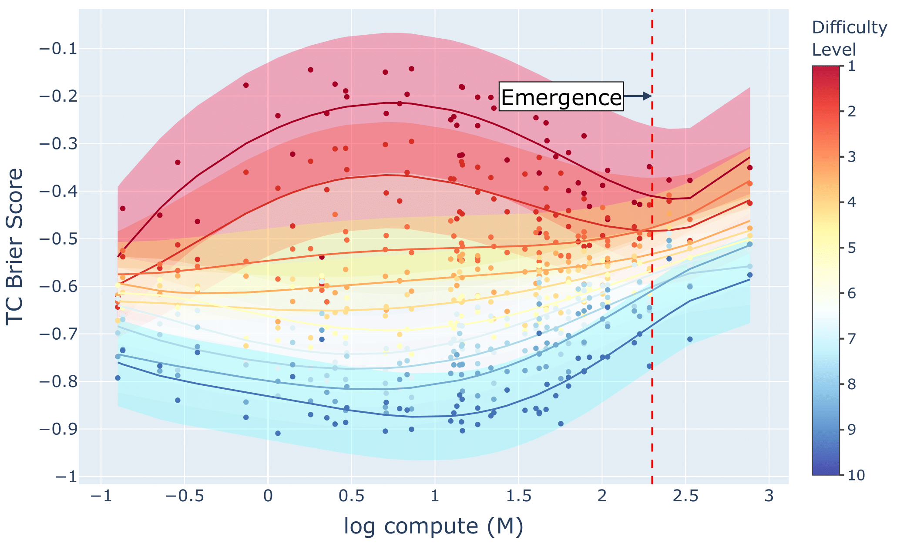

# U-shaped-and-Inverted-U-Scaling-behind-Emergent-Abilities-of-Large-Language-Models
Official code of the paper [U-shaped and Inverted-U Scaling behind Emergent Abilities of Large Language Models](https://arxiv.org/abs/2410.01692)

## News
- (Nov. 2024) The paper has been accepted to NeurIPS'24 ATTRIB workshop as **oral presentation**.

## Overview
This paper explains why LLMs sometimes experience emergent abilities. In short, [deep double descent](https://arxiv.org/abs/1912.02292) on easy questions and [U-shaped scaling](https://arxiv.org/abs/2211.02011) on hard questions offset each other, leading to initially flat overall performance. The performance soar occurs around the happening of second descent on easy questions. We further provide a simple pipeline to forecast the occurrence of emergent abilities.

<p float="left">
  
   
</p>

## Setup
Download and set up the repository:
```bash
git clone https://github.com/tony10101105/U-shaped-and-Inverted-U-Scaling-behind-Emergent-Abilities-of-Large-Language-Models.git
cd U-shaped-and-Inverted-U-Scaling-behind-Emergent-Abilities-of-Large-Language-Models
```
```bash
conda env create -name ExpEmergence -file requirements.txt
conda activate ExpEmergence
```

## :rocket: Usage
We include six scripts to replicate main results of this work:

**Plot model overall performance measured by accuracy or TC Brier Score:**
```bash
python plot_overall_performance.py
```
**Plot model performance on each question group measured by TC Brier Score:**
```bash
python plot_question_group_tc_brier.py
```
**Plot model performance on each question group measured by accuracy:**
```bash
python plot_question_group_acc.py
```
**Perform Slice-and-Sandwich to construct the accuracy-based scaling law using models before emergence threshold:**
```bash
python fit_cluster.py.py
```
**Slice-and-Sandwich's robustness analysis regarding polynomial degree:**
```bash
python fit_cluster_robustness_degree.py
```
**Slice-and-Sandwich's robustness analysis regarding emergence threshold:**
```bash
python fit_cluster_robustness_threshold.py
```

We welcome you to use our code and data to exploit new insights and methods.

## Citation
```
@article{wu2024u,
  title={U-shaped and Inverted-U Scaling behind Emergent Abilities of Large Language Models},
  author={Wu, Tung-Yu and Lo, Pei-Yu},
  journal={arXiv preprint arXiv:2410.01692},
  year={2024}
}
```
